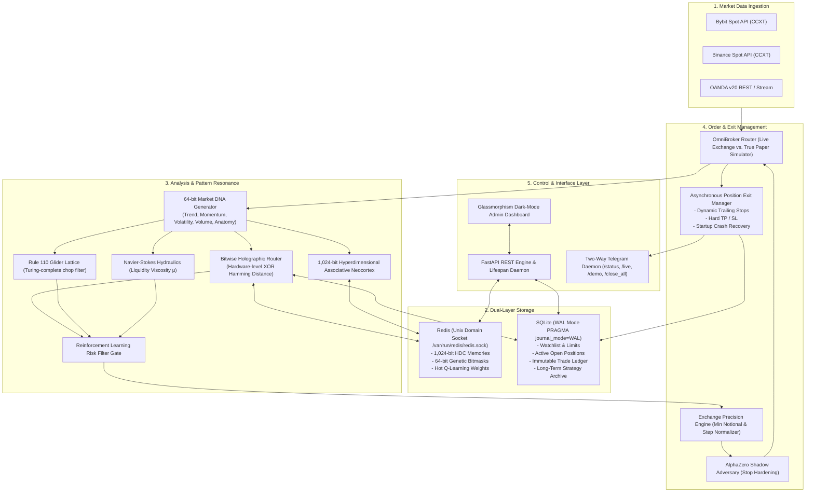

# 01. Architecture Overview

## 1. System Topology

QuantumBit BHR is an autonomous algorithmic trading platform optimized for low-latency execution on low-cost virtual private servers (e.g. Hetzner CX22, 1 vCPU, 2GB RAM, €3.79–€5/month). 

The platform avoids heavyweight deep learning dependencies (like PyTorch or TensorFlow) that cause out-of-memory errors on budget servers. Instead, it utilizes **hardware-level bitwise operations, hyperdimensional vector math, and discrete cellular automata**, executing trade analysis in microseconds.

---

## 2. Memory Tier Architecture (Zero-Lock Concurrency)

Traditional algorithmic bots frequently crash due to SQLite `OperationalError: database is locked` or JSON read/write file corruption during high-frequency operations. QuantumBit decouples hot state from persistent storage:

### Tier 1: Hot Volatile Cache (Redis via Unix Socket)
* **Access Protocol**: Direct Unix Domain Socket (`/var/run/redis/redis.sock`), bypassing the TCP/IP network stack entirely.
* **Latency**: <0.05 milliseconds per read/write.
* **Data Held**:
  - `mask:{symbol}`: 64-bit integer genetic attention mask evolved for that specific asset.
  - `q:{symbol}:{regime}:{action}`: Real-time reinforcement learning weights.
  - `hdc:{symbol}`: 1,024-bit hypervectors for one-shot black-swan pattern matching.

### Tier 2: Persistent Cold Ledger (SQLite in WAL Mode)
* **Access Mode**: Write-Ahead Logging (`PRAGMA journal_mode=WAL;`).
* **Concurrency**: Multiple concurrent readers (FastAPI dashboard, telemetry pollers) can read simultaneously while background writers (exit manager, trade logger) write with zero lock conflicts.
* **Tables**:
  1. `watchlist`: Symbols, asset classes, assigned brokers, step sizes, and minimum notional values.
  2. `open_positions`: Real-time state of active trades (for crash recovery).
  3. `trade_ledger`: Immutable audit trail of completed trades, fees, durations, and net PnL.
  4. `strategy_archive`: Market memories tagged with market regimes and historical win rates.
  5. `system_config`: Runtime dynamic configuration (mode, broker, trade size, strictness).

---

## 3. End-to-End Trade Lifecycle

1. **Scheduled Scan (Every 30s)**:
   - The `autonomous_trading_loop` wakes up and queries active pairs from SQLite.
2. **Candle Ingestion & Entropy Mapping**:
   - Fetches recent OHLCV bars. Feeds all pairs into `EntropyWaveCollapseEngine` to evaluate cross-asset market synchronization.
3. **Glider Chaos Filter (Rule 110)**:
   - Evaluates the 128-cell lattice. If spatial entropy indicates `THERMAL_CHOP`, the asset is skipped immediately, preventing whipsaw losses.
4. **DNA Fingerprinting & Resonance**:
   - `MarketFingerprintGenerator` extracts a 64-bit unsigned integer.
   - BHR applies the pair's Genetic Bitmask (`current_fp & mask`) and executes hardware-level XOR Hamming distance matching against historical memories.
5. **Fluid Hydraulics & HDC Validation**:
   - `LiquidityHydraulicsEngine` computes the Viscosity Index ($\mu$). If a Cavitation Shock (liquidity vacuum) is detected in the direction of the trade, confidence is boosted.
   - `HyperdimensionalMemory` performs an associative recall in 1,024-bit space.
6. **Q-Learning Gate**:
   - `QLearningExecutionFilter` combines BHR confidence with historical regime weights and checks concurrent trade limits.
7. **Adversarial Stop Hardening**:
   - `ShadowAdversarySandbox` runs 50 synthetic Monte Carlo predatory stop-hunts against the proposed entry, widening the trailing stop to clear liquidity shelves.
8. **Precision Normalization & Execution**:
   - `PrecisionEngine` scales the amount to exchange step rules and verifies minimum cost.
   - Order is executed (Live via CCXT/OANDA or simulated locally via True Paper Engine).
9. **Event-Driven Exit Monitoring**:
   - A dedicated `asyncio.Task` polls the position every 4 seconds.
   - Dynamic Trailing Stop activates once profit reaches `+0.8%` and triggers exit on a `0.25%` pullback.
10. **Reinforcement Learning Feedback**:
    - Upon position close, the net PnL updates the Bellman equation in Redis and records a one-shot vector in the HDC memory bank.
