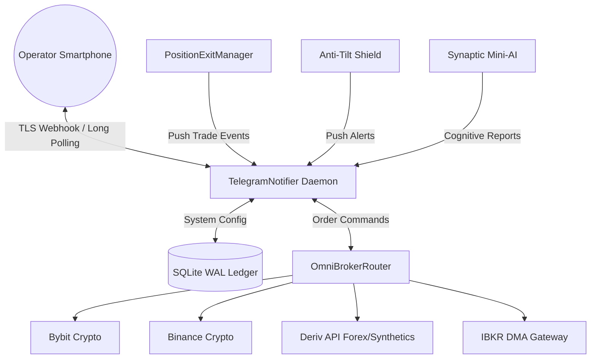

# Telegram Remote Control & Mobile Alerting Daemon

The QuantumBit BHR engine features an event-driven, asynchronous two-way Telegram daemon ([bots/telegram_bot.py](file:///c:/Users/User/Documents/GitHub/trading-bot/bots/telegram_bot.py), class `TelegramNotifier`). It provides real-time mobile push notifications for trades, risk events, and entropy phase transitions, while giving operators full command of the trading fleet, perpetual futures leverage, and AI distillation directly from a smartphone.

---

## 1. Setup & Credentials Configuration

### A. Bot Creation via BotFather
1. Open Telegram and search for `@BotFather`.
2. Send `/newbot` and follow prompts to set your bot's display name and username (e.g. `QuantumBitBhrBot`).
3. Save the HTTP API Token provided (e.g. `7890123456:AAFlk...`).

### B. Personal Chat ID Retrieval
1. Search for `@userinfobot` on Telegram and send `/start`.
2. Copy your unique numerical user `Id` (e.g., `123456789`).

### C. Configure `.env`
Add your credentials to `.env`:
```bash
TELEGRAM_BOT_TOKEN=7890123456:AAFlk...
TELEGRAM_CHAT_ID=123456789
TELEGRAM_ENABLED=True
```

### D. Verification via Dashboard
Navigate to the web dashboard (`http://127.0.0.1:8000/`) and scroll to the **Telegram Mobile Remote Control & Telemetry** widget. Click **"🔔 Send Test Alert"** to test webhook/polling dispatch immediately.

---

## 2. Security Guardrails & Access Filtering

To prevent unauthorized remote execution:
- The bot authenticates every incoming message's `chat_id` against `settings.TELEGRAM_CHAT_ID`.
- Any command received from external accounts, third parties, or unauthorized groups is rejected, ignored, and logged as an intrusion attempt.
- Sensitive kill-switch commands execute atomic database reconciliation and cancel asynchronous tasks without leaving lingering orders on exchanges.

---

## 3. Comprehensive Mobile Command Suite

The daemon operates an asynchronous long-polling loop (`getUpdates`, 30s timeout) consuming minimal CPU and bandwidth on Hetzner VPS instances.

### A. Telemetry & Fleet Operations
| Command | Arguments | Description & Action |
|---|---|---|
| `/status` or `/stats` | None | Returns live portfolio equity, win rate %, open trade count, and engine scanner status. |
| `/balance` or `/wallet` | None | Detailed multi-broker balance audit: free USDT, locked margin, total equity, and margin buffer %. |
| `/pnl` or `/report` | None | Audited realized profit/loss, win/loss breakdown, and fee savings from Maker-First routing. |
| `/fleet` | None | Pings all connected broker adapters (`bybit`, `binance`, `deriv`, `ibkr`) and reports real-time latency (ms). |
| `/setbroker` | `<name>` | Changes primary routing destination (e.g. `/setbroker deriv`, `/setbroker bybit`). |
| `/live` | None | Switches execution engine to **Live Capital Trading** (real order placement). |
| `/demo` | None | Switches engine to **True Paper Trading** (real market data, zero-risk simulation). |

### B. Mobile Trade Execution & Position Controls
| Command | Arguments | Description & Action |
|---|---|---|
| `/trade` | `<SYM> <BUY\|SELL> [SIZE]` | Instantly dispatches a mobile market/maker order (e.g. `/trade BTC/USDT BUY 15`, `/trade R_50 BUY 5`). Auto-arms trailing stop. |
| `/positions` | None | Returns tick-by-tick real-time monitoring of all open positions, entry prices, current prices, and floating PnL %. |
| `/close` | `<position_id>` | Selectively closes a single open position at market price (e.g. `/close paper_075d8196`). |
| `/close_all` | None | **Emergency Kill Switch**: Immediately cancels monitoring tasks and market-closes every open trade across all brokers. |

### C. Perpetual Futures & Margin Sizing
| Command | Arguments | Description & Action |
|---|---|---|
| `/futures` | None | Displays current Perpetual Futures status, default leverage, margin mode, and liquidation buffer. |
| `/leverage` | `<1-10>` | Dynamically tunes leverage multiplier (e.g. `/leverage 3`, `/leverage 5`). Enforces 10x safety cap for micro-accounts. |
| `/margin` | `<isolated\|cross>` | Toggles margin mode between **Isolated** (losses strictly confined to trade) and **Cross**. |
| `/funding` | None | Displays real-time 8-hour perpetual funding rates for `BTC/USDT`, `ETH/USDT`, `SOL/USDT`, and `1HZ100V` with countdown timer. |

### D. Risk Geometries & VPS Self-Funding
| Command | Arguments | Description & Action |
|---|---|---|
| `/risk` | `<TP%> <SL%>` | Dynamically updates Take Profit and Stop Loss thresholds (e.g. `/risk 1.8 0.5`). |
| `/treasury` | None | Shows VPS Cloud Treasury reserve status ($4.50 monthly goal for Hetzner CX22 server). |
| `/circuit` | None | Inspects Anti-Tilt Cooling state, consecutive loss counters, and spread shield status. |
| `/reset_circuit` | None | Manually clears cooling period freeze if market volatility normalizes. |

### E. Synaptic Mini-AI Cognition & Universes
| Command | Arguments | Description & Action |
|---|---|---|
| `/brain` or `/synaptic` | None | Reports AI Cognitive Rank (Level & IQ), accumulated experience points (XP), and top evolved symbolic formula. |
| `/distill` | None | Manually triggers counterfactual replay distillation to reinforce winning patterns without catastrophic forgetting. |
| `/universe` | `<preset>` | Injects curated market universes: `crypto`, `forex`, `metals`, `synthetics`, `macro`. |
| `/help` | None | Displays mobile command cheat sheet. |

---

## 4. Real-Time Alert Notification Schemas

### A. Mobile Order Fill Alert
```markdown
⚡ *TELEGRAM ORDER EXECUTED!*
Filled: *BUY 0.00015 BTC/USDT* @ $64,250.00
Venue: *bybit* | Allocation: *$9.64*
Trailing stop armed at +0.8%.
```

### B. Trade Closed (Take Profit / Trailing Stop / SL)
```markdown
🎯 *TRADE CLOSED*
Symbol: `EUR_USD`
Side: `BUY` | Reason: `TRAILING_STOP_PULLBACK`
Entry: $1.08250 -> Exit: $1.08412
Net PnL: *+$0.16* (+1.50%)
Duration: 6.4 min
```

### C. Anti-Tilt Circuit Breaker Activated
```markdown
🚨 *CIRCUIT BREAKER TRIGGERED*
Reason: 2 consecutive losses (-1.2% daily impact)
Action: 45-minute cooling period engaged.
No new orders will be submitted until market stabilizes.
```

### D. Perpetual Futures Liquidation Shield Alert
```markdown
🛡️ *PERPETUAL FUTURES RISK ALERT*
Contract: `BTC/USDT:USDT` (3x Leverage)
Liquidation Buffer: 33.3% price move
Mode: Isolated Margin (Portfolio cash strictly protected)
```

---

## 5. Integration Architecture


